Perceptron Build Guide
===========================

This guide will walk you through building a Perceptron. For more information about the Perceptron and this project, see the [README file](README.md). The only required skill is basic soldering of simple through-hole components to printed circuit boards (PCBs). Bonus if you have a 3D printer to make it look nice.

The outline of the build process is as follows:

1. Obtain the PCBs.
2. Obtain all of the other components.
3. Solder the components to the PCBs.
4. Final assembly.
5. (Optional) Build frames.

The last step is optional for those who want to make it look nice. You'll need a 3D printer. Without this step, your Perceptron will look something like this:

With a 3D printer, you can print the frames and make it look like this:

If you don't have a 3D printer but still at least want a front plate for the weight knobs, there are some simple things you can do with sheet metal. Either way, it will work the same.

If you want to skip this build guide and just jump right in with the schematics, the PCB Gerbers, the BoM, and the 3D-print files, then here they are:

- Schematics:
  - [Input board](assets/schematic_input.pdf)
  - [Adder board](assets/schematic_adder.pdf)
- PCB Gerbers:
  - [Input board](PCBs/PerceptronInputGerbers.zip)
  - [Adder board](PCBs/PerceptronAdderGerbers.zip)
- BoM: [csv file](BoM.csv), [pdf file](assets/bom.pdf)
- 3D-print files: [Frames directory](Frames/)

# 1. Obtain the PCBs

There are 2 PCBs - the *Input board* and the *Adder board* - and you can get them from a fabricator such as [JLCPCB](https://jlcpcb.com/) or [PCBWay](https://www.pcbway.com/). If you've never done this before, it may sound intimidating, but I can assure you that it's quite simple. I'll explain how to do it.

The only friction is a bit of cost. The fabricators generally require a minimum order of 5 boards for each PCB design, and since they're in China, there's shipping and tarrif costs as well. The cost of 5 boards is about $15; multiply that by 2, since there are 2 different PCBs; the shipping cost is about $50; and the tariffs are about $15. So the total cost is about $95. On the plus side, for that cost, you'll have 5 of each PCB, and they ship pretty quickly.

I'd love to see more people building these, so if this cost is a real barrier, I'd be happy to get a bunch of these boards made and then send them directly to you. Just let me know. After all, the per-PCB cost is actually quite low, especially when ordered in decent quantities.

Right now, my recommendation is to use JLCPCB - they build and ship quickly, their quality is great, and their Web interface is quite easy to use. PCBWay is also great and easy to use, but sometime recently they stopped accepting payment by PayPal or credit card, so it's a bit difficult to do the actual purchase. Hopefully, they'll fix that soon. I'll explain the generic steps that work for either site, and I'll provide a detailed step-by-step with screenshots for JLCPCB.

The way you do this is by uploading the Gerber files to the fabricator's website. Gerber files are special files that provide all of the information that the fabricator needs to manufacture the PCBs. For each PCB design, all of the Gerber files are packaged together in a single zip archive file. You'll find the two Gerber zip files for the two PCBs in the `PCBs` directory:
- [`PerceptronInputGerbers.zip`](PCBs/PerceptronInputGerbers.zip)
- [`PerceptronAdderGerbers.zip`](PCBs/PerceptronAdderGerbers.zip)

Download them both to your local machine.

Now, go to the fabricator's website and find the place to "Get instant quote" or similar. That should bring you to a page that has a button to "Add Gerber file" or similar. Click that button and upload either one of the Gerber zip files you just downloaded. The website will upload and process the file (which may take a few minutes), and then it will show you a preview of the PCB with the dimensions automatically detected. For the Input PCB, the dimensions should be 164mm x 86mm. For the Adder PCB, the dimensions should be 122mm x 132mm. Now you can "Save to cart." There's no need to change any of the specifications or options - the defaults are fine. Now repeat for the other PCB. With both PCBs in your cart, you can proceed to checkout in the standard way.

[Here](JLCPCB.md) is the step-by-step with screenshots for JLCPCB.

They'll probably take a little over a week to arrive. Rejoice!

# 2. Obtain all of the other components

[Here](BoM.csv) is the Bill of Materials (BoM) for all of the components you'll need:

There's also a [PDF version](assets/bom.pdf) of the BoM if you prefer.

For each component, I've tried to find an inexpensive, readily-available option, and I've put links to them in the `Link` and `Alt Link` columns. In the case of the meter, the only inexpensive sources I could find are coming from China. They're cheap and readily available but take a bit of time in shipping. See below for more information about obtaining the meter.

The `Value` column is used to identify each component on the schematic. For now, you can ignore that column.

The `Qty` column tells you how many of each component you'll need, but realize that the Amazon links go to products that are packs with multiple components. For example, the Amazon LEDs is a pack of 100, so you only need to order one. So for each item you order, make sure you check the number of components in the pack against the quantity needed. The exception is the Digikey links. From [Digikey](https://www.digikey.com/), you can order exactly the number of components you want. If you prefer, you'll find equivalent components on [Mouser](https://www.mouser.com/). In general, I recommend using Digikey or Mouser, but in the case of the toggle switches, I wasn't able to find an inexpensive option on Digikey or Mouser.

## Battery holders

There's no provision for an on-off switch on the PCBs (including one seemed like overkill), so to turn the device on and off, you'll need to either have an easy way to connect and disconnect the battery holders to and from the PCB or use battery holders that have an on-off switch built in. I don't much like the battery holders with on-off switches (there's no good way to mount them inside my 3D-printed frames), so I recommend using standard battery holders, like the ones under the `Link` column, with a pin header and socket for easy connect and disconnect. 

To use the pin header and socket, you'll need to be able to do simple crimping. If you've never done it before, don't worry - it's easy and a crimping tool is cheap. The result will look like this:

You can also use this method to connect the meter to the other PCB. Much better than soldering directly to the PCB.

If you really insist on soldering directly to the PCB, then the `Alt Link` goes to holders that do have an on-off switch built in.

Easy, but I don't much like it - not just because I don't much like the holders with switches, but because it's just awkward to have the holders permanently soldered to the PCB.

## Pin headers and sockets

The `Link` for the 2-pin and 4-pin headers and sockets in the BoM goes to a full kit of Dupont connectors with plenty of pin headers and sockets with a range of pin counts. You'll just need one of these kits, and you only need the 2-pin size for the meter and the 4-pin size for the battery holders. This one comes with a crimping tool, and the Amazon page also has a short video demonstrating how to use it. It's easy, but if you've never done it before, experiment first with some scrap wire before crimping to the battery holders. Of course, if you already have a crimping tool, feel free to buy connectors without the tool. Also, feel free to use whatever style of pin headers and sockets you prefer. Just make sure that they connect and disconnect easily for the batteries, since that's the on-off switch (unless you use battery holders with built-in on-off switches), and that the pitch (distance between pins) is 2.54mm.

For the 2x10-pin headers, you just need to make sure that the pitch is 2.54mm and that they will accomodate the ribbon cable. For the ribbon cable, I recommend going as short as you can find.

## Meter

For the meter, you need an analog DC current meter that measures current in both directions and with a reasonable range for this particular circuit. I've found that ones that measure from minus 100 microamps to plus 100 microamps (-100 uA to +100 uA) are about right for this circuit.

Here are 3 that I've tested and work great:

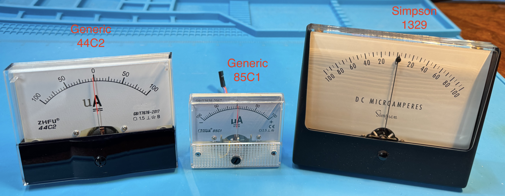

The first one is the one in the `Link` column of the BoM. It's a generic brand 44C2-style meter. The second one is the one in the `Alt Link` column of the BoM. It's a generic brand 85C1-style meter. The 44C2 is a good size for this project, so I recommend going with that one. Make sure that when you order from AliExpress, you click on the option for the 100UA-0-100UA measuring range.

The third meter is the one I used in the video, and it's a Simpson model 1329. Simpson actually has made lots of models (with different sizes and styles) with a -100 uA to +100 uA measuring range. The Simpson meters are excellent, but they're expensive and hard to find. I found mine on eBay. If you find one and want to pony up the money, you'll have the best looking Perceptron on the block.

If you want to explore other meter options, [this video](https://www.youtube.com/watch?v=wbRx5cQZ8Ts) gives a great overview of how these meters work. And [this video](https://www.youtube.com/watch?v=4U-nxdp-LDw) provides a good explanation of how to use a shunt resistor to get your meter to operate at the desired range. The PCB has a place for a shunt resistor in case you need one.

But if you're using a meter from the BoM or a Simpson like the one I used in the video or probably anything with a -100 uA to +100 uA or greater measuring range, then don't put a shunt resistor on the PCB - leave that spot unpopulated.

## Other components

Feel free to use components other than those linked in the BoM. For the toggle switches, just make sure they're DPDT (double-pole double-throw), and that the pin configuration matches. For the potentiometers, just make sure they're 10k ohm and that the pin configuration matches. The potentiometers from Digikey (the `Alt Link`) are a bit more expensive, but they have a center detent which I like. For the potentiometer knobs, just make sure they fit your potentiometers. For the LEDs, any colors except blue should work fine. Just make sure that the lead spacing is 2.54mm. For the resistors, any power rating and tolerance will be fine, and there are tons of choices. Just make sure to match the resistance values (68 ohms and 10k ohms), and make sure they're no longer than 6.5mm. For the wire, pretty much anything will work, but I recommended stranded wire at around 22-24 guage.

## Optional components

For the wire connections to the meter, you can just wind stripped wire around the binding posts but better to crimp on ring terminals. For the 44C2 meter, you'll want M3 or #6 stud terminals. You can get a full kit with different sizes from Amazon or individual connectors from Digikey or Mouser:

- [Ring terminal kit from Amazon](https://www.amazon.com/gp/product/B0CCYJS85G/)
- [Individual ring terminal connectors from Digikey](https://www.digikey.com/en/products/detail/molex/0190440066/3878515)

If you don't have a 3D printer or are not going to build frames, you probably at least want some M3 standoffs, so the boards sit above the table with room below for the connectors.

- [M3 standoffs from Amazon](https://www.amazon.com/gp/product/B0B3Y6WF2Y/)

If you are going to 3D print frames, then besides the filament, you'll need M3x6 screws to fasten the boards to the frames, and either glue or M2x4 flat head (countersink) screws to fasten the battery holders to the frame.

- [M3x6 round head screws from McMaster-Carr](https://www.mcmaster.com/97763A812/)
- [M2x4 flat head screws from McMaster-Carr](https://www.mcmaster.com/91294A002/)

# 3. Solder the components to the PCBs

Both PCBs are double-sided, so you'll need to solder components to both sides. The silkscreen markings indicate on which side and where each component goes. I recommend doing the rear side of each board first.

## Rear side

Here is a photo of the rear side of both boards.

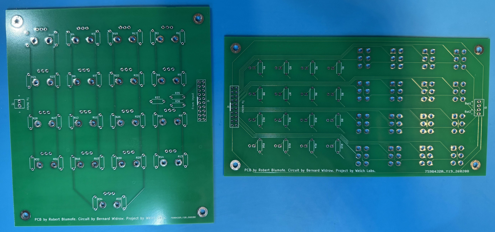

This side is where the resistors and pin headers go. These components are mounted on the rear side, so of course, you solder on the front side.

The 16 resistors, R1-R16, on the Input board are the 68 ohm resistors, and the 36 resistors, R1-R36, on the Adder board are the 10k ohm resistors. Leave R37, the shunt resistor location, unpopulated, unless you're using a meter that requires a shunt resistor (as desribed above).

When it comes to inserting the 2x10-pin headers, J1 on both boards, if they are notched - as is the case with the ones in the BoM - then you need to make sure that they are inserted in the same orientation on both boards so that the ribbon cable can connect the two boards without having to be twisted. If you insert both connectors with the notch aligned with the marking on the slikscreen, then you'll be fine. ([Here](assets/orient_2x10_header.jpg) is a close-up image.) In general, so long as you can connect the two boards without twisting the ribbon cable, then you're good to go. This is what it should look like:

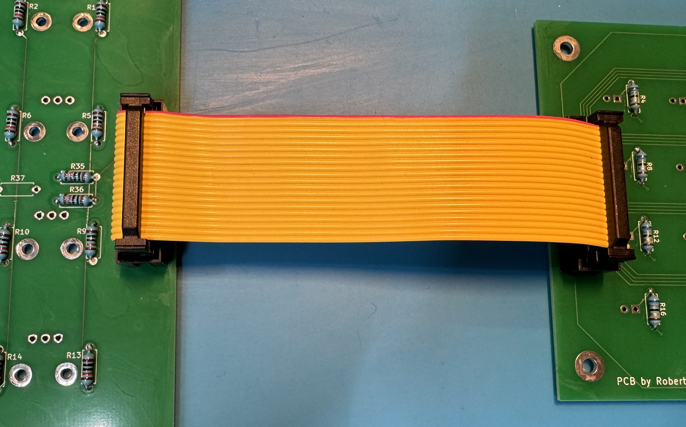

If you're going to solder the battery holder wires and meter wires directly to the PCBs, then best to do that later, after you've mounted the front-side components. Otherwise, go ahead and solder in the 4-pin header, J2 of the Input board, and the 2-pin header, J2 of the Adder board. The rear side of both boards, now done, should look like this:

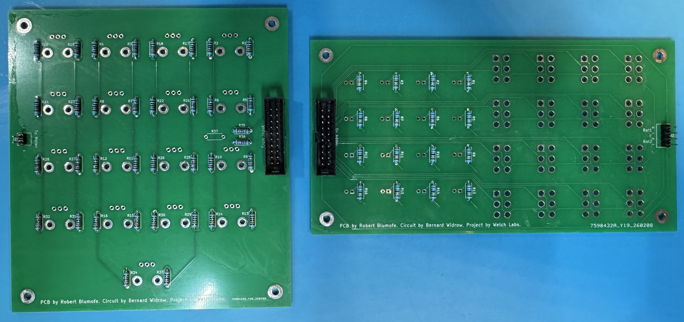

This is now a good time to clean the front side of both boards - the side where you just did the soldering. A scrub with a stiff-bristled brush and isopropyl alcohol will do the trick.

## Front side

Now on to the front-side components (which, of course, get soldered on the rear side). Here is a photo of the front side of both boards with all of the rear-side components already soldered in place.

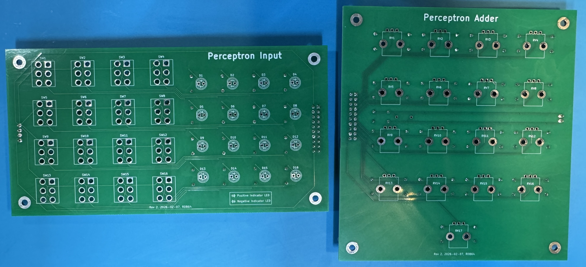

Starting with the front side of the Input board, this is where the 16 toggle switches, SW1-SW16, and 16 LEDs, D1-D16, go. The toggle switches can go in in either orientation.

The LEDs, however, require more care. You'll notice that the LEDs have a long lead and a short one. ([Here](assets/orient_led.jpg) is a close-up image.) At the very least, make sure that they're all installed with the same orientation - either all with the long lead on the right or all with the long lead on the left. If you're using the LEDs from the BoM, then if you install with the long lead on the right, then you'll get red for plus one (toggle switch up) and green for minus one (toggle switch down). That's how I did it. If you prefer the opposite, then just install with the long lead on the left.

**Important**: If you are going to use the 3D printed frames, don't solder the LEDs until you've read the last section. The LEDs need to be mounted a few millimeters above the board, aligned with the top of the toggle switch housings and the frame's front plate. Fortunately, I've created a 3D printable input-board soldering jig to make this super easy. You're going to want to print out this jig and follow the instructions to use it in order to ensure that you have the LEDs at the right height above the PCB.

Moving on to the front side of the Adder board, this is where the 17 potentiometers, RV1-RV17, go.

Go ahead and clean the rear side of both boards now. Your PCBs are now done. They should look like this (in this case with the LEDs mounted a few millimeters above the board using the 3D printed jig):

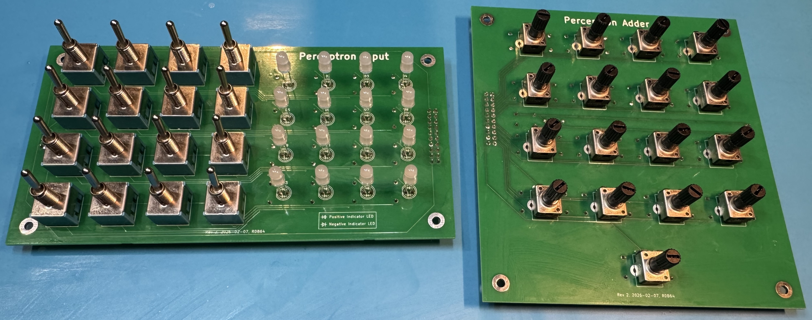

Rejoice again!

# 4. Final assembly

To complete your Perceptron, all that remains is to connect the battery holders to the Input board, connect the meter to the Adder board, and connect the two boards together with the ribbon cable.

## Battery holders

To connect the battery holders to the Input board, ideally you're using the 4-pin header and socket, but if you have holders with built-in on-off switches, you can just solder directly to the board. Just make sure that the battery-holder lead wires line up properly with the holes on the board as shown in the photos in the "Battery holders" section above. As labeled on the board, from top to bottom the order is: battery-1 positive, battery-1 negative, battery-2 positive, battery-2 negative. 

If using the header and socket, insert the crimped leads into the socket in that order. Then when it's time to turn your Perceptron on, you just push the socket onto the header, making sure to do it in the correct orientation (with battery-1 positive at the top position). Fortunately, the battery-holder leads are color-coded, so just make sure that the red wire is at the top position.

## Meter

To connect the meter to the Adder board, you need 2 lengths of hook-up wire - about 6 inches is a reasonable length. I recommend using 2 different colors, say red for the positive lead and blue or black for the negative lead.

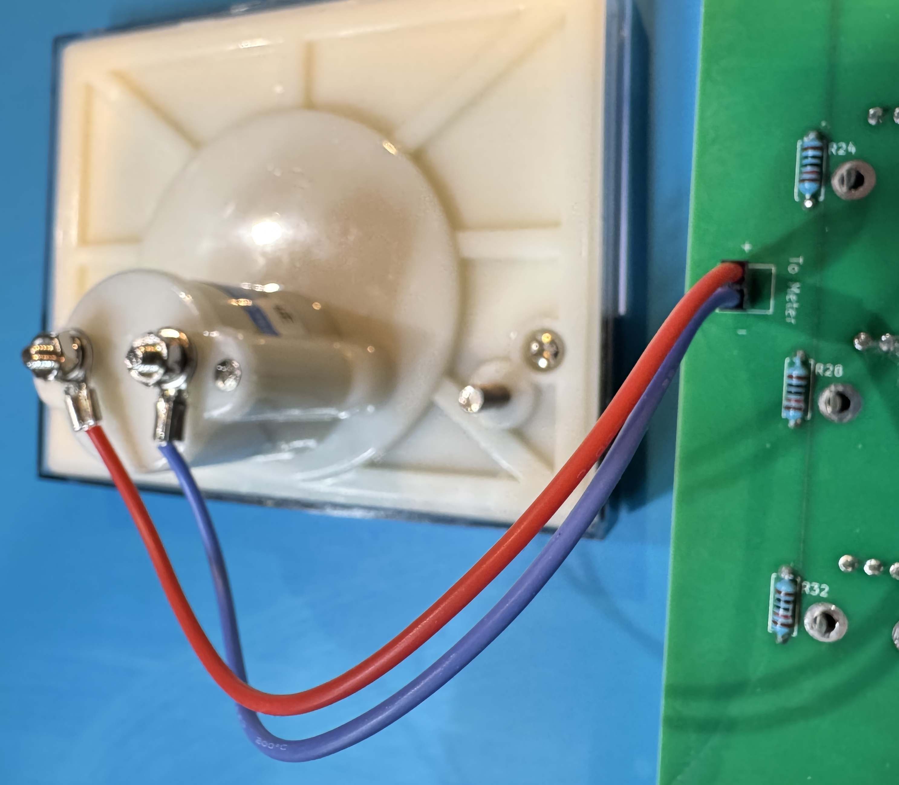

They correspond to the markings on the PCB and to the markings on the meter. The meter's 2 binding posts should be labelled. For example, as viewed from behind, the 44C2 meter from the BoM has a "-" symbol embossed below the right binding post (though not very easy to see), and my Simpson 1329 meter has a "+" marking near the left binding post. If there is no marking, go with left as positive and right as negative (as viewed from behind).

To connect the wires to the meter, I recommend using crimp-on ring terminals as shown in the image above. For the 44C2 meter, either M3 or #6 stud will fit well. Of course, you can also just wrap the stripped wire around the binding posts and secure with the washer and nut.

To connect the wires to the Adder board, I recommend using a 2-pin header and socket as shown in the image above and just like the 4-pin header and socket recommended for the battery holders. Of course, you can also just solder the wires directly to the board.

## Ribbon cable

Finally, connect the 2 boards together with the ribbon cable as shown in several images above. If you're finding that the ribbon cable exits the connector going in the wrong direction, just swap ends.

## Testing and troubleshooting

Your Perceptron should now work. Just push the battery-holders socket onto the header (red wire at the top) or flip the switches (if your battery holders have built in switches), and the LEDs should light up. Then as you turn the potentiometer knobs, you should see the meter needle move.

If none of the LEDs light up, the problem is probably with the connection to the batteries. If the LEDs light up but are backwards color-wise, then either the battery leads are backwards or the LEDs were inserted backwards. If an individual LED is not lighting up, then it's probably bad. If the meter is not moving as much as you think it should, then maybe there's a retaining wire connected across the meter's binding posts. (Some meters, like my Simpson 1329, ship with a retaining wire connected across the binding posts to keep the needle from wiggling around during shipping.) If the needle is moving in the wrong direction, then maybe the meter leads are backwards.

Finally, here's the one problem that I have actually encountered: an individual potentiometer not working - the meter needle doesn't respond to turning the knob. The problem could be the potentiometer, but for me, every time this happened it was not the potentiometer - it was fragility in the ribbon cable or in the ribbon-cable connector. Simply swapping the ribbon cable or disconnecting and reconnecting fixed the problem every time.

If you don't have a 3D printer or are not planning to build frames, then you're done. The only additional things you might want to do is put knobs on the potentiometers and use some M3 standoffs so the boards stand above the table with room below for the connectors.

# 5. (Optional) Build frames

The 3D print files, in 3mf format, are all in the [Frames](Frames) directory, and they're split between the actual frames - the orange parts in this photo - and the face plates - the blue parts. I made them separate objects, because i wanted to do them in different colors, and I don't have a multi-color 3D printer. 

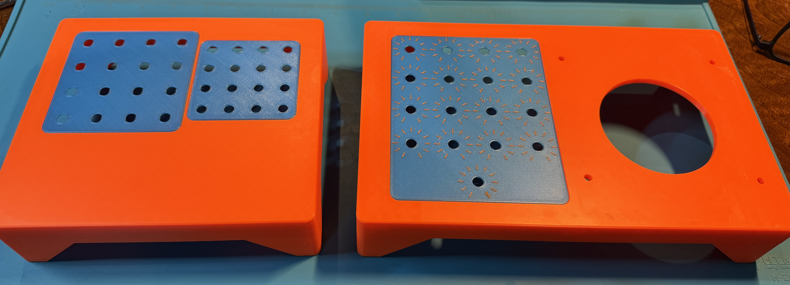

In this directory you'll also find the soldering jig that you need to mount the LEDs at the right height above the Input board, as described in the "Soldering the components to the PCBs" section above.

The file names should be pretty self-explanatory, but here's a list:

- [input_board_solder_jig.3mf](Frames/input_board_solder_jig.3mf) - the soldering jig to mount the LEDs at the right height above the board
- [input_frame.3mf](Frames/input_frame.3mf) - the frame for the Input board (orange part at left of photo above)
- [switches_face_plate.3mf](Frames/switches_face_plate.3mf) - the face plate for the switches (blue part on the left side of the input frame)
- [LEDs_face_plate.3mf](Frames/LEDs_face_plate.3mf) - the face plate for the LEDs (blue part on the right side of the input frame)
- [adder_with_44C2meter_frame.3mf](Frames/adder_with_44C2meter_frame.3mf) - the frame for the Adder board with the 44C2 meter (orange part at right of photo above)
- [adder_with_S1329meter_frame.3mf](Frames/adder_with_S1329meter_frame.3mf) - the frame for the Adder board with the Simpson 1329 meter (similar to the orange part at right of photo above)
- [adder_no_meter_frame.3mf](Frames/adder_no_meter_frame.3mf) - the frame for the Adder board with no meter (not shown)
- [pots_face_plate_outie.3mf](Frames/pots_face_plate_outie.3mf) - the face plate for the potentiometers with the dial markings embossed outwards (blue part on the adder frame)
- [pots_face_plate_innie.3mf](Frames/pots_face_plate_innie.3mf) - the face plate for the potentiometers with the dial markings debossed inwards (similar to the blue part on the adder frame)

All of these objects can be printed with PLA, no supports, and simple (default) settings.

## Soldering jig

The first of these objects that you'll want to print is the Input-board soldering jig, since you need it to solder the components on the front side of the Input board. After you're done soldering, it's a throw-away part, so you can print it with the cheapest and fastest settings available. The jig looks like this with the bottom slide up:

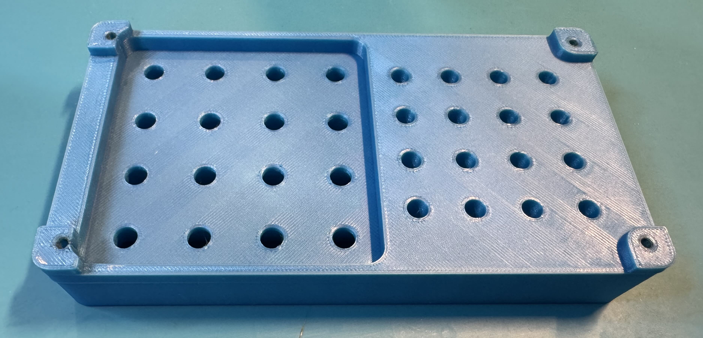

To use it, first insert all of the front-side components: the switches and the LEDs. Make sure that the switches are all toggled up or all toggled down (just to make it possible to slide the jig over them). And make sure that the LEDs are all inserted in the right orientation (e.g., all of them with the long lead on the right).

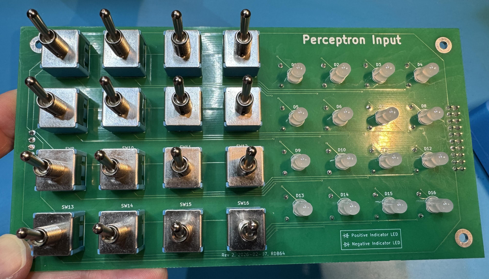

Now slide the jig over the top of the components, making sure that all of the holes line up so each switch goes into its hole and each LED goes into its hole. It likely will require a bit of wiggling to get everything to line up properly and to allow the jig to sit flat on the board. You should see all of the switches sticking up through the top of the jig.

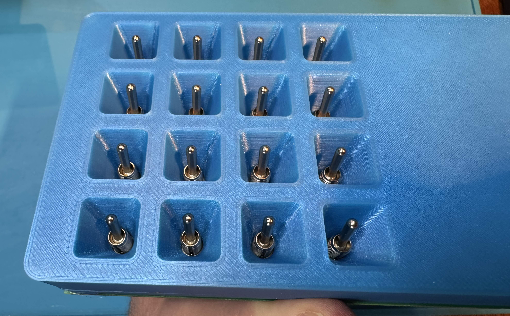

And the jig should be sitting flat on the board.

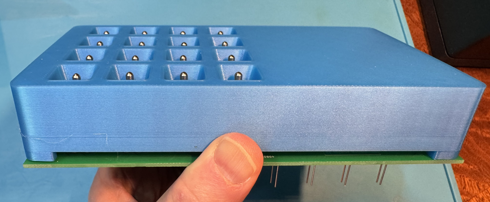

Now you can turn the jig over and sit it down on the table. You should see all of the LED leads (and the switch leads) sticking up through the bottom of the board. Note that all of the LED leads have the long lead on the same side (the left side in this photo, which is the right side when looking from the top).

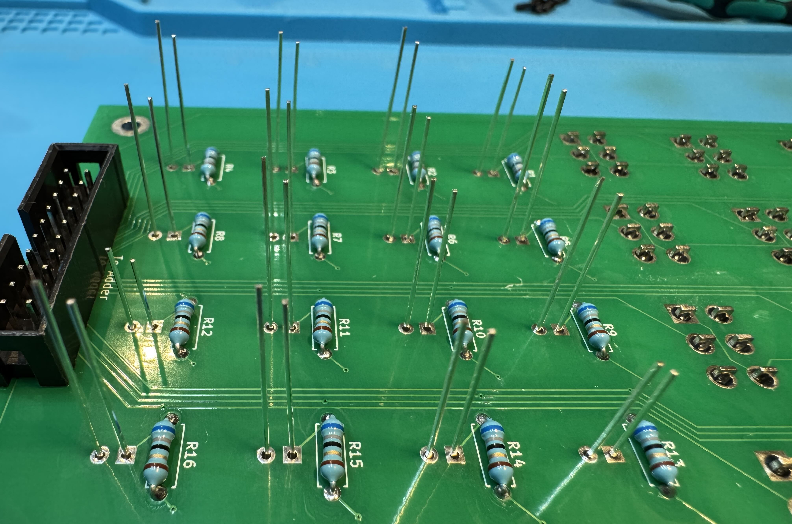

If you want, you can now temporarily secure the board to the jig with M3x6 screws in the mounting holes.

Next, you want to push each of the LEDs down into the bottom of the hole in the jig. Just gently push down on the leads and maybe wiggle a bit. You want to make sure each LED is pushed all the way down. You should be able to see that all of the LEDs have their left leads sticking up to the exact same height and likewise the right leads.

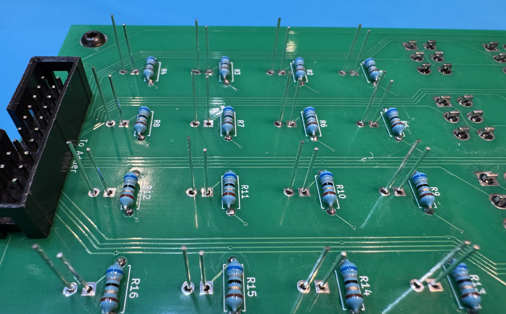

Now you can go ahead and solder everything as you normally would. When done, just remove the jig. Your Input board should look like this with all of the LEDs sticking up above the board by the exact same and correct amount.

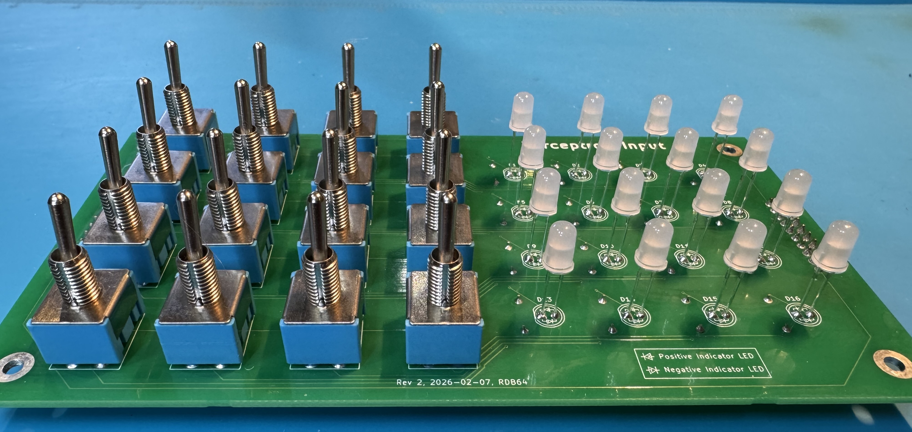

Aint that beautiful?

## Input-board frame

For the Input-board frame you'll need to print out the frame itself and the two face plates. Once printed, use M3x6 round head screws to secure the board to the frame. There's also a place where you can secure the battery holders either with glue or M2x4 flat head screws.

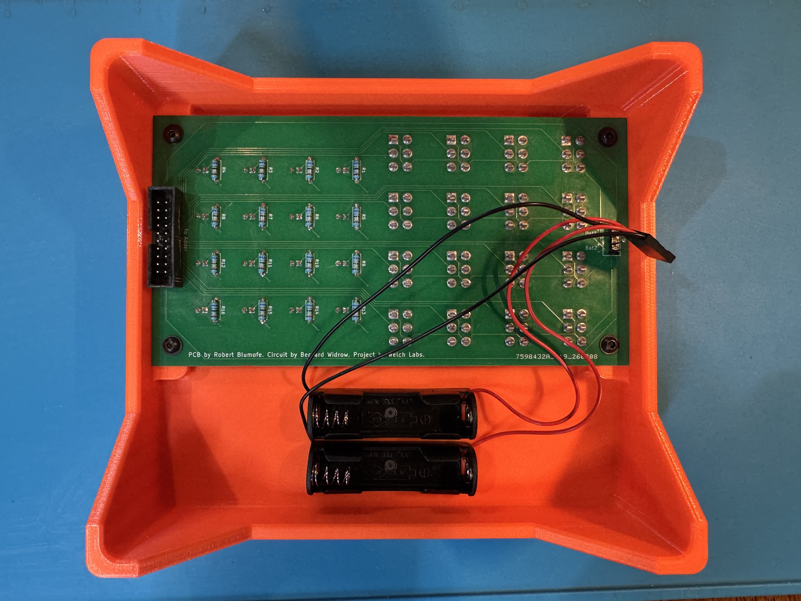

## Adder-board and meter frame

For the Adder-board and meter frame you'll need to print out the right frame for the type of meter you have and a face plate. If you don't have a 44C2 or Simpson 1329 meter, then you can print out a the frame with no meter. For the potentiometers' face plate, I created two choices: one with the dial markings embossed outwards and one with the dial markings debossed inwards.

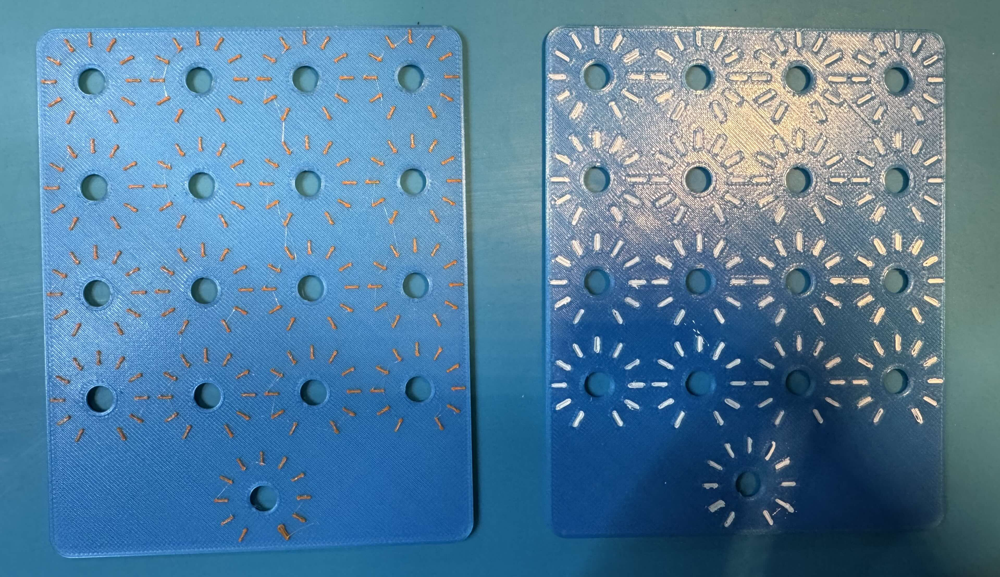

If you use the embossed version, then during printing, you can do a color change for the last 2 layers to make the dial markings visible as seen above left. If you use the debossed version, then when printing is done, you can use an ultra-fine point marker to color in the dial markings as seen above right.

Once everything is printed, use M3x6 round head screws to secure the board to the frame, and use the hardware supplied with your meter to secure the meter to the frame.

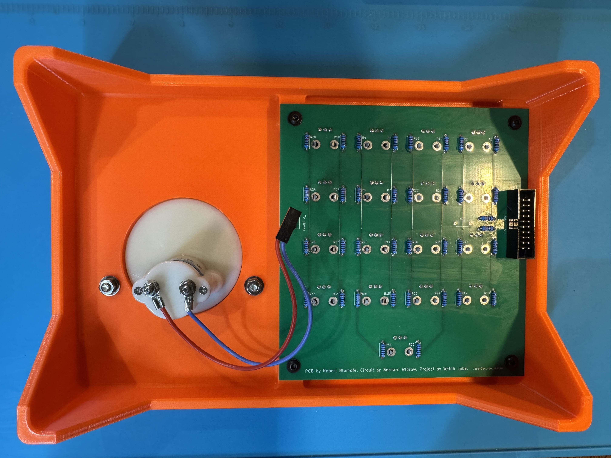

## Final assembly

Turned right-side up, your two frames should now look like this:

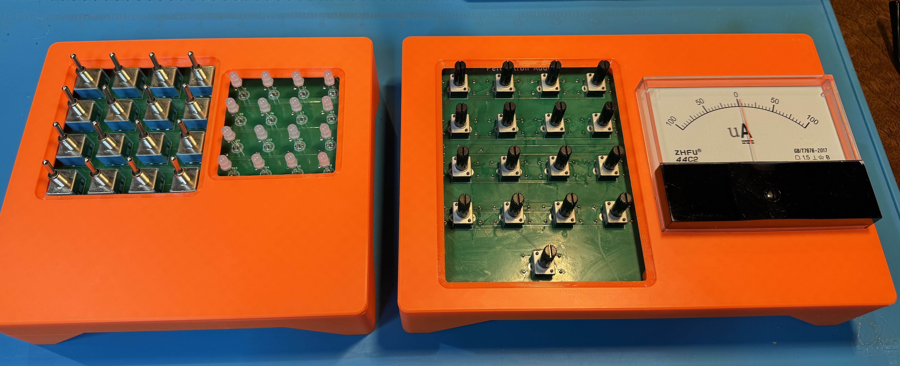

Now just pop on the face plates, pop on the potentiometer knobs (after the face plate), connect the boards with the ribbon cable, connect the meter to the Adder board, insert the batteries, and you're done! Turn it on and watch the lights light up!

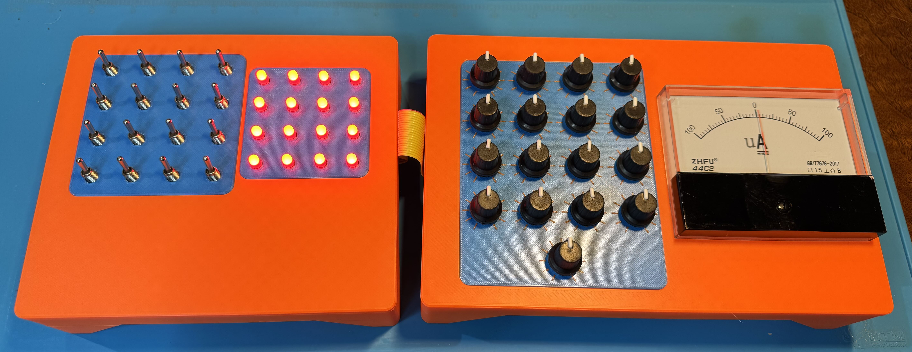

Now rejoice and go teach someone about neural nets.
