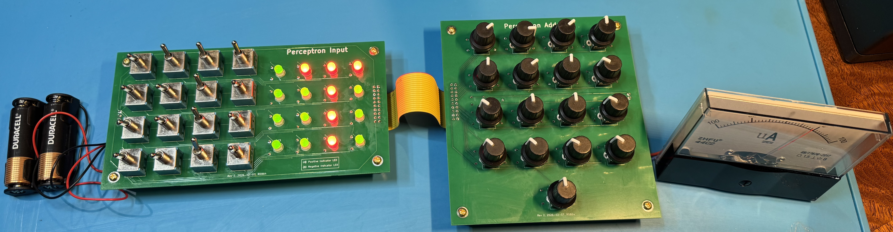
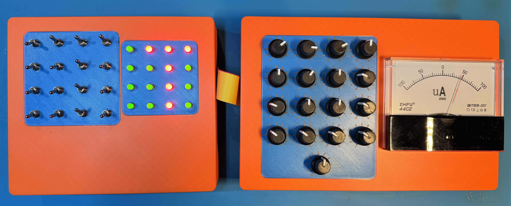
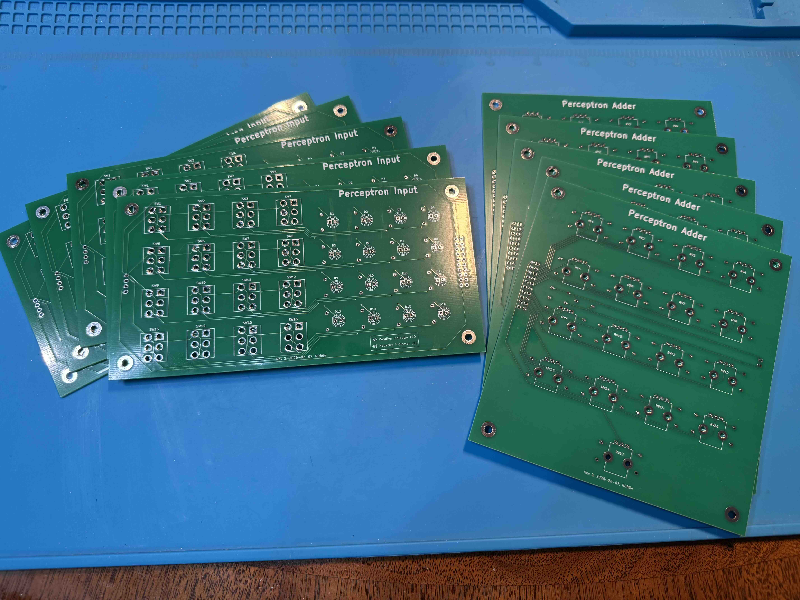
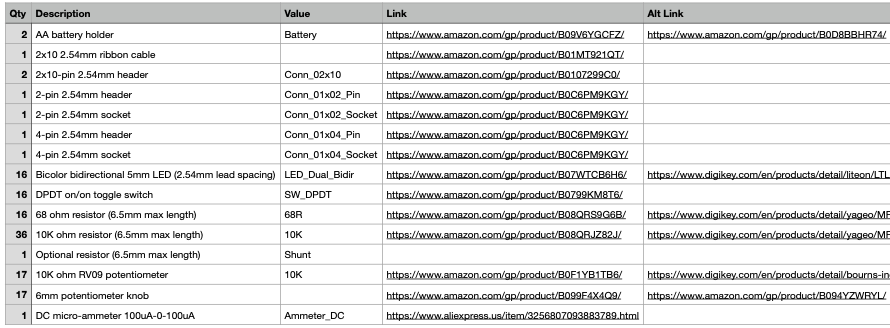
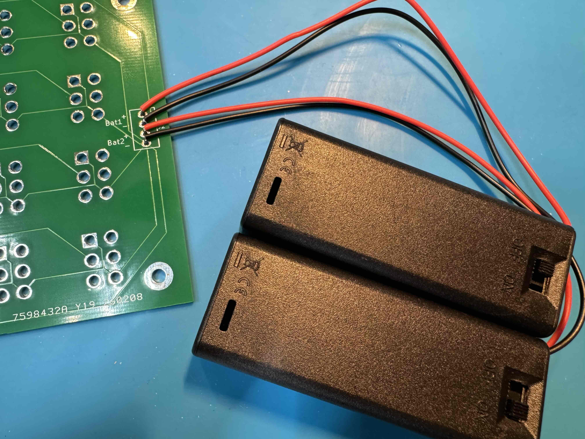
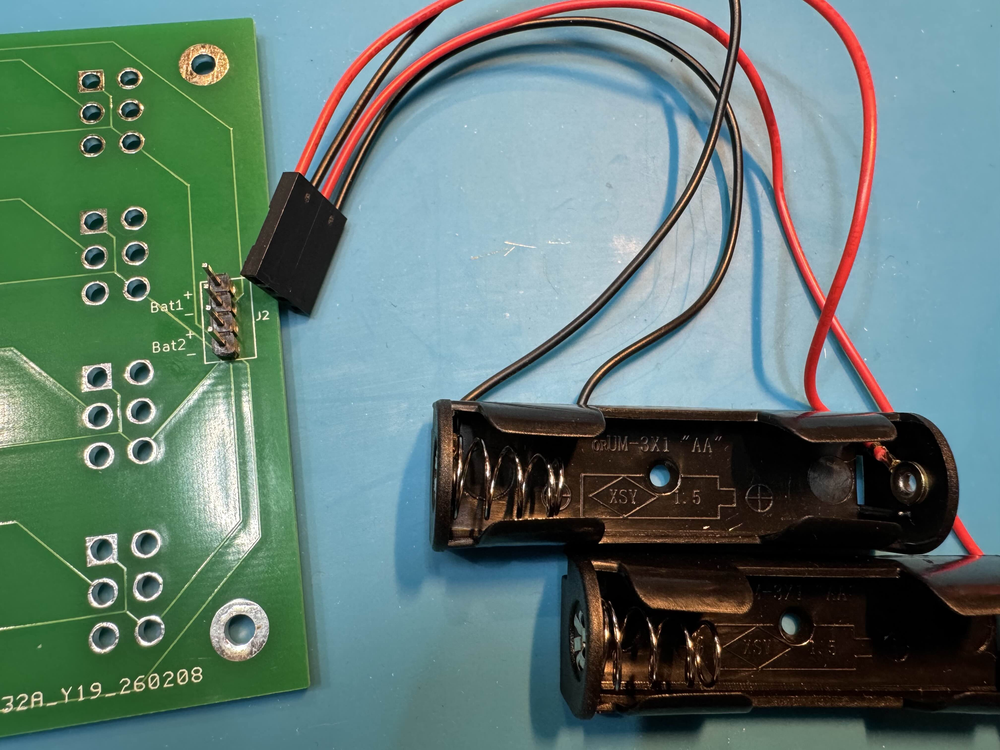
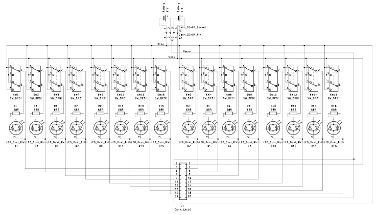
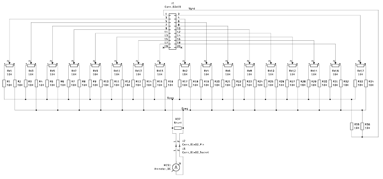

Perceptron Build Guide
===========================

This guide will walk you through building a Perceptron. For more information about the Perceptron and this project, see the [README](README.md). The only required skill is basic soldering of simple through-hole components to printed circuit boards (PCBs). Bonus if you have a 3D printer to make it look nice.

The outline of the build process is as follows:

1. Obtain the PCBs.
2. Obtain all of the other components.
3. Solder the components to the PCBs.
4. Connect the battery holders and meter and ribbon cable.
5. (Optional) Build frames.

The last step is optional for those who want to make it look nice. You'll need a 3D printer or some basic skills with sheet metal. Without this step, your Perceptron will look something like this:

With a 3D printer, you can print the frames and make it look like this:

If you don't have a 3D printer but still at least want a front plate for the weight knobs, there are some simple things you can do with sheet metal. Either way, it will work the same.

# 1. Obtain the PCBs

There are 2 PCBs - the Input board and the Adder board - and you can get them from a fabricator such as [JLCPCB](https://jlcpcb.com/) or [PCBWay](https://www.pcbway.com/). If you've never done this before, it may sound intimidating, but I can assure you that it's quite simple. I'll explain how to do it.

The only friction is a bit of cost. The fabricators generally require a minimum order of 5 boards for each PCB design, and since they're in China, there's shipping and tarrif costs as well. The cost of 5 boards is about $15; multiply that by 2, since there are 2 different PCBs; the shipping cost is about $50; and the tariffs are about $15. So the total cost is about $95. On the plus side, for that cost, you'll have 5 of each PCB, and they ship pretty quickly.

I'd love to see more people building these, so if this cost is a real barrier, I'd be happy to get a bunch of these boards made and then send them directly to you. Just let me know. After all, the per-PCB cost is actually quite low, especially when ordered in decent quantities.

Right now, my recommendation is to use JLCPCB - they build and ship quickly, their quality is great, and their Web interface is quite easy to use. PCBWay is also great and easy to use, but sometime recently they stopped accepting payment by PayPal or credit card, so it's a bit difficult to do the actual purchase. Hopefully, they'll fix that soon. I'll explain the generic steps that work for either site, and I'll provide a detailed step-by-step with screenshots for JLCPCB.

The way you do this is by uploading the Gerber files to the fabricator's website. Gerber files are special files that provide all of the information that the fabricator needs to manufacture the PCBs. For each PCB design, all of the Gerber files are packaged together in a single zip archive file. You'll find the two Gerber zip files for the two PCBs in the `PCBs` directory:
- [`PerceptronInputGerbers.zip`](PCBs/PerceptronInputGerbers.zip)
- [`PerceptronAdderGerbers.zip`](PCBs/PerceptronAdderGerbers.zip)

Download them both to your local machine.

Now, go to the fabricator's website and find the place to "Get instant quote" or similar. That should bring you to a page that has a button to "Add Gerber file" or similar. Click that button and upload either one of the Gerber zip files you just downloaded. The website will upload and process the file (which may take a few minutes), and then it will show you a preview of the PCB with the dimensions automatically detected. For the Input PCB, the dimensions should be 164mm x 86mm. For the Adder PCB, the dimensions should be 122mm x 132mm. Now you can "Save to cart." There's no need to change any of the specifications or options - the defaults are fine. Now repeat for the other PCB. With both PCBs in your cart, you can proceed to checkout in the standard way.

[Here](JLCPCB.md) is the step-by-step with screenshots for JLCPCB.

They'll probably take a little over a week to arrive. Rejoice!

# 2. Obtain all of the other components

[Here](BoM.csv) is the bill of materials (BoM) for all of the components you'll need:

There's also a [PDF version](assets/bom.pdf) of the BoM if you prefer.

For each component, I've tried to find an inexpensive, readily-available option, and I've put links to them in the `Link` and `Alt Link` columns. The one exception is the meter. The only inexpensive source I could find is AliExpress. They're cheap but coming from China. See below for more information about obtaining the meter.

The `Value` column is used to identify each component on the schematic and the PCB layout. It will come into play when we get to building, but for now, you can ignore that column.

The `Qty` column tells you how many of each component you'll need, but realize that the Amazon links go to products that are packs with multiple components. For example, the Amazon LEDs is a pack of 100, so you only need to order one. So for each item you order, make sure you check the number of components in the pack against the quantity needed. The exception is the Digikey links. From Digikey, you can order exactly the number of components you want. In general, I recommend using Digikey, but in the case of the toggle switches, I wasn't able to find an inexpensive option on Digikey.

## Battery holders (to crimp or not to crimp)

There's no provision for an on-off switch on the PCBs (including one seemed like overkill), so to turn the device on and off, you'll need to either have an easy way to connect and disconnect the battery holders to and from the PCB or use battery holders that have an on-off switch built in. I don't much like the battery holders with on-off switches (there's no good way to mount them inside my 3D-printed frames), so I recommend using standard battery holders with a pin header and socket for easy connect and disconnect. To do this, you'll need to be able to do simple crimping. If you've never done it before, don't worry - it's easy and a crimping tool is cheap.

The `Alt Link` for the battery holders is to holders that do have an on-off switch built in, so if you use those, you can just solder the wire leads directly to the PCB like this:

Easy, but I don't much like it - not just because I don't much like the holders with switches, but because it's just awkward to have the holders permanently soldered to the PCB. Better is to connect the battery holders to the PCB with a pin header and socket like this:

You can also use this method to connect the meter to the other PCB. Again, much better than soldering directly to the PCB.

The `Link` for the 2-pin and 4-pin headers and sockets (rows 5-8) in the BoM goes to a full kit of Dupont connectors with plenty of pin headers and sockets with a range of pin counts. You'll just need one of these kits, and you only need the 2-pin size for the meter and the 4-pin size for the battery holders. This one comes with a crimping tool, and the Amazon page also has a short video demonstrating how to use it. It's easy, but if you've never done it before, experiment first with some scrap wire before crimping to the battery holders. Of course, if you already have a crimping tool, feel free to buy connectors without the tool. Just make sure the pitch (distance between pins) is 2.54mm.

## Meter

# 3. Solder the components to the PCBs

Below are the schematics for the two PCBs. If you click on the schematic image, you'll get the PDF version.

Input board schematic:

Adder board schematic:

# 4. Connect the battery holders and meter and ribbon cable

# 5. (Optional) Build frames