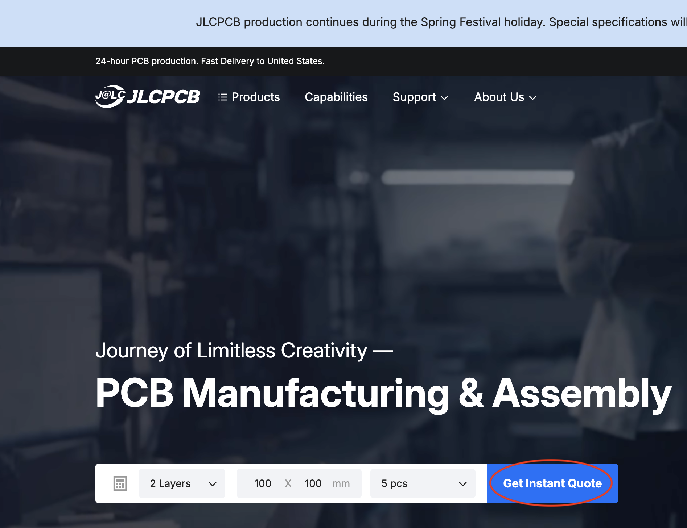
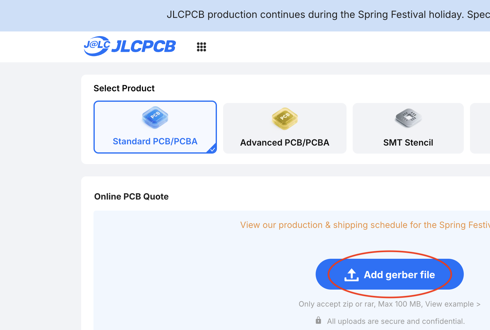
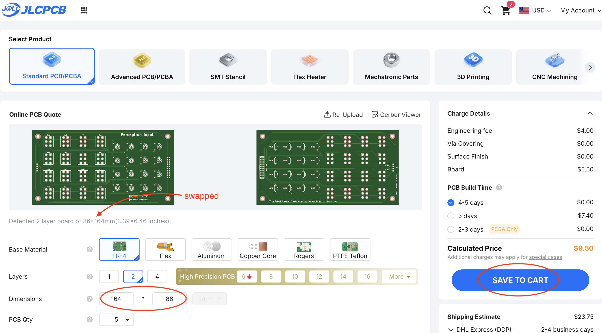
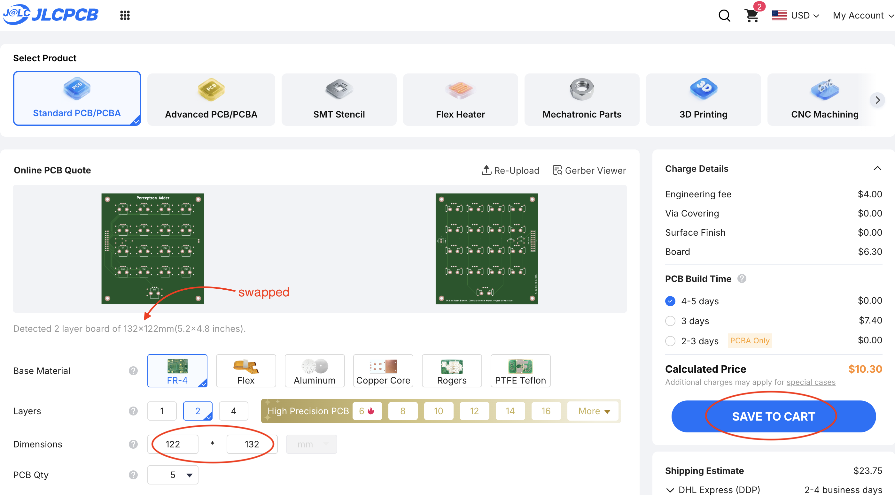
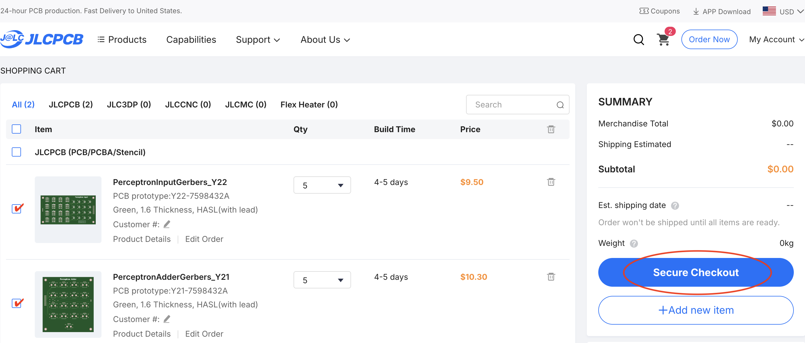

Ordering from JLCPCB
======================

Go to the [JLCPCB website](https://jlcpcb.com/). The website should look like this:

Click on "Get Instant Quote". This will take you to a page that looks like this:

Click on "Add gerber file" and follow the dialog to select either one of the Gerber zip files you downloaded. You can also do this by dragging the file into the page. The website will do the upload with a progress bar, and then it will process the file. This may take some minutes. When done, it will show a preview of the board.

If the upload is failing, try logging into the site first. (Weird, but I've had this happen before.) You can create an account and log in with your Google or Apple identity, so no need to create a new username and password.

If you've uploaded the Gerber zip file for the Input board, you should see a preview of the board like this:

If you've uploaded the Gerber zip file for the Adder board, you should see a preview of the board like this:

Note that it automatically detects the number of layers and the dimensions. Both boards are 2 layers. The Input board is 164mm x 86mm and the Adder board is 122mm x 132mm. (Don't worry that the "detected" note has the dimensions swapped.)

You'll see a whole lot of additional specifications and options: for example, base material, quantity, and much more. There's no need to change any of these values unless you want to up the quantity and order more than 5 boards.

Now click "SAVE TO CART".

And then repeat for the other board.

You can now proceed to checkout by clicking on the cart icon in the top right corner. You should see a page like this:

Before clicking "Secure Checkout", you'll need to select both boards in the cart. From here, the checkout process is like like any other site you've ever used. If you haven't already done so, you'll need to create an account or log in, but you can use your Google or Apple identity, so no need to create a new username and password.

Easy peasy.
